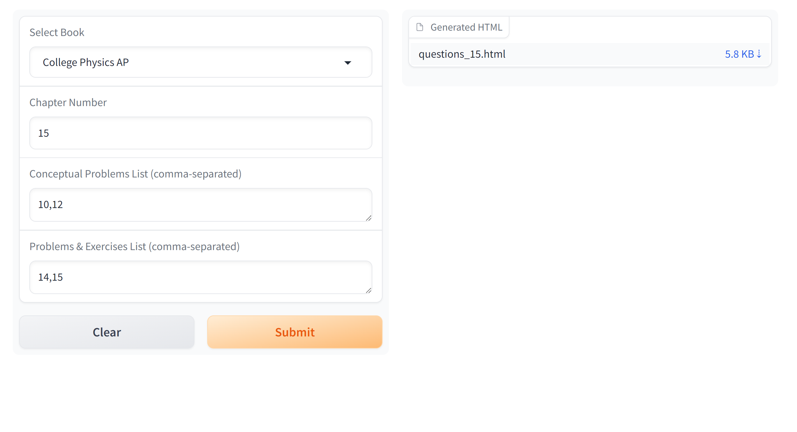
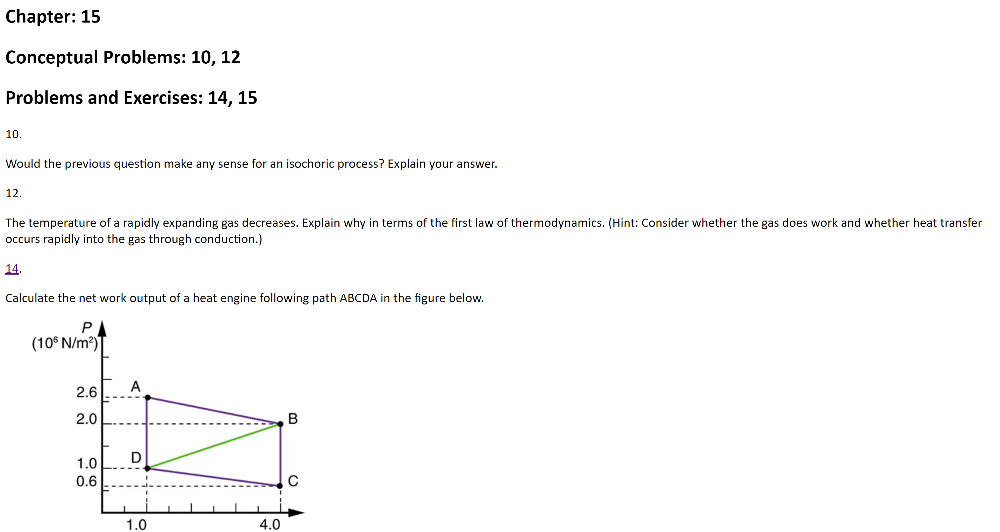

## Physics Homework Worksheet Creator

Mr.James Kim assigns a list of questions on openstax everyday as homework. This app extracts questions from openstax website and creates an organized worksheet, so you don't have to flip through openstax yourself!

Above is the app interface. First, select your textbook from the dropdown menu. Then input the chapter number and problem lists. The app will automatically extract questions from openstax website and create a worksheet. You can download the worksheet as a html file. The html file will look like this in your browser:

The app will automatically extract all the related images and hyperlinks too, so don't worry about missing anything!

You may print the document as a pdf file by hitting Ctrl+P in your browser.

## Deployment

This app is running on [Huggingface Spaces](https://huggingface.co/spaces/ymcmy/physics_pdf).

### Run in a local Python environment:

```sh
pip install -r requirements.txt
python app.py
```

### Run with Docker:

```docker
docker run -it -p 7860:7860 --platform=linux/amd64 \
    registry.hf.space/ymcmy-physics-pdf:latest python app.py
```
